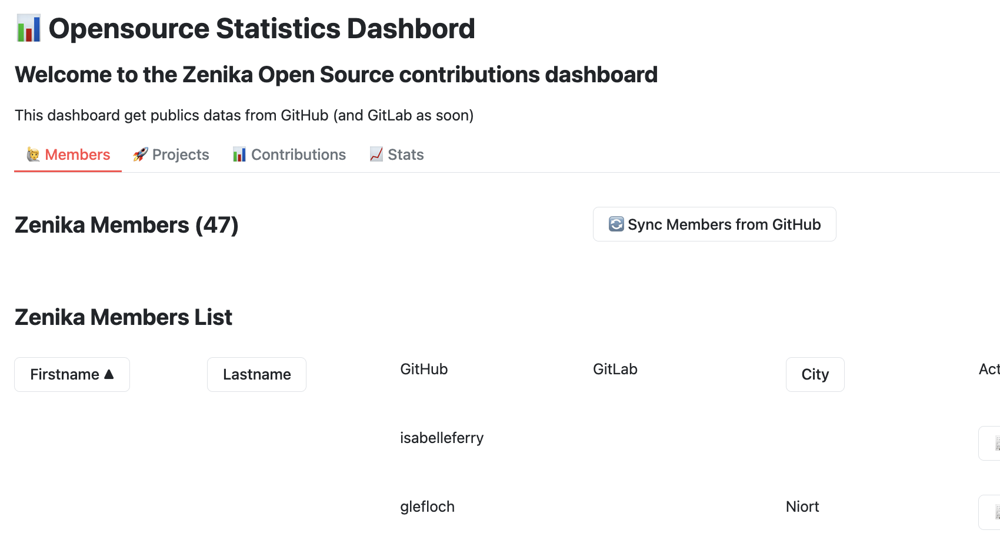

# Opensource-statistiques 📊


🚧 This project is in progress ... 

One objective of this project is to highlight Zenika members for their open source contributions. 

To do this, the zenika-open-source GitHub Organization is scanned and data is saved in a private Database on GCP.
Data could be used to find and list projects maintained or forked by Zenika Members, all projects to which Zenika members contributed, etc.

## 🗄️ Tech 

Using:
- [Quarkus](https://quarkus.io/)
- [Firestore](https://docs.quarkiverse.io/quarkus-google-cloud-services/) to save data
- [GitHub actions](https://github.com/features/actions) as CICD - to be implemented
- [Javelit](https://javelit.io) to display information

## 🌐 API 

Some resources are available but only the first is in progress : 
- `/github/` to get information about Zenika Open Source GitHub organization and members from GitHub
- `/gitlab/` to get information about Zenika Open Source GitHub organization and members from GitLab 🚧 not implemented
- `/members/` to get information from GCP database 🚧 not implemented
- `/contributions/` to get information about contributions from GCP database 🚧 not implemented
- `/workflow/` to get data and save them on GCP database

## 🎨 UI 

An interface made with Javelit is available.
- `http://localhost:8888` to access the Javelit dashboard




> 🎯 The last resource will be removed after implementing all features and will be replaced by schedules. 

## 📝 Local Setup 

- You need a GitHub token you can generate on [this page](https://github.com/settings/tokens).
- Create a `.env` file based on the `.env-example` file and set the token previously created. 
- Create a `.gcloud-conf.json` file in the root of the project containing your Google Cloud service account key. This is required for the application to authenticate with GCP services.
- **Set the `GOOGLE_APPLICATION_CREDENTIALS` environment variable** to point to your key file. This is crucial for authentication in your local environment.
  ```bash
  export GOOGLE_APPLICATION_CREDENTIALS=$(pwd)/.gcloud-conf.json
  ```
- Run the application with `quarkus dev` if you have the Quarkus CLI installed on your environment, or `mvn quarkus:dev` command.
- You can use Quarkus dev service for Firestore enabling this variable `quarkus.google.cloud.firestore.devservice.enabled` in application.properties file.

## 🐳 Docker

Start by building the image:

```bash
docker build -t zoss-dashboard .
```

Then run the container mapping the ports (8080 for API, 8888 for UI) and mounting the credentials:

```bash
docker run -it --rm \
  -p 8080:8081 \
  -v "$(pwd)/.gcloud-conf.json:/etc/gcp/creds.json:ro" \
  --env-file .env \
  -e GOOGLE_APPLICATION_CREDENTIALS=/etc/gcp/creds.json \
  zoss-dashboard
```

## ⛅ Deploy on Cloud Run 

This project can be deployed on [Cloud Run](https://cloud.google.com/run) with this command: 

```bash
  gcloud run deploy zenika-opensource-statistics \
   --source . \
   --region $GOOGLE_CLOUD_LOCATION \
   --project $GOOGLE_CLOUD_PROJECT_ID \
   --allow-unauthenticated \
   --memory 1Gi \
   --max-instances 1
```

## ✨Contribute 

Anyone can contribute to this project. For the moment, please add your question or propose something in [a new issue](https://github.com/zenika-open-source/opensource-statistics/issues).


